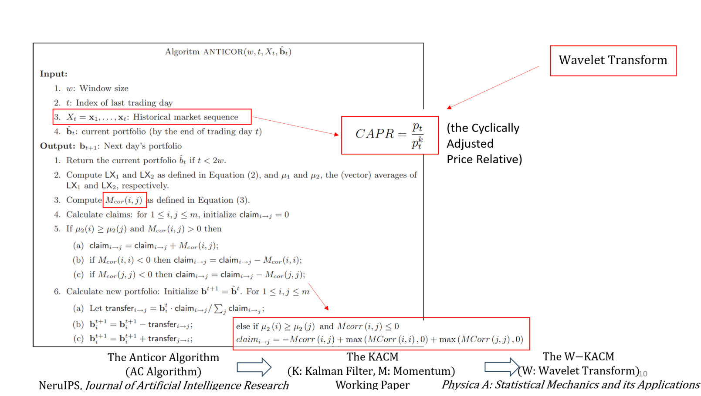

### 1. The Anticor Algorithm

W-KMAC算法是对Antior (AC)算法的改进，其改进内容如上图所示。因此我在本节中先对AC算法进行介绍。

下面是对本节中符号的描述。

|      | Symbol                                                       | Description                                                  |
| ---- | ------------------------------------------------------------ | ------------------------------------------------------------ |
| 1    | $\mathbf{v}_t=\left(v_t(1), \ldots, v_t(m)\right)$           | daily closing prices                                         |
| 2    | $m$                                                          | $m$ stocks                                                   |
| 3    | $i$、$j$                                                     | $i^{th}$ stock、$j^{th}$ stock                               |
| 4    | $t$                                                          | $ t^{th}$ day                                                |
| 5    | $x_t(j)=v_t(j) / v_{t-1}(j)$                                 | relative prices                                              |
| 6    | $\mathbf{x}_t=\left(x_t(1), \ldots, x_t(m)\right)$           | market vector of relative prices                             |
| 7    | $\mathbf{b}=(b(1),\ldots,b(m))$                              | a portfolio                                                  |
| 8    | $\mathbf{b}\cdot\mathbf{x}=\sum_{j}b(j){{x(j)}}$             | daily return                                                 |
| 9    | $\mathbf{{r}}\mathbf{et}_{X}(\mathbf{b}_{1},\ldots,\mathbf{b}_{n})$=$\prod_{t=1}^{n}\mathbf{b}_{t}\cdot\mathbf{x}_{t}$ | the (compound) total return                                  |
| 10   | $X=\mathbf{x}_1,\ldots,\mathbf{x}_n.$                        | a market sequence                                            |
| 11   | $\mathcal{A}$                                                | a portfolio selection algorithm                              |
| 12   | $\operatorname{ret}_{X}(\mathcal{A})$                        | the algorithm's total return for the market sequence $X$     |
| 13   | $w$                                                          | the most recent past $w $ trading days, integer parameter    |
| 14   | $\log(\mathbf{x}_{k})$                                       | a vector, $(\log(x_{k}(1)),\ldots,\log(x_{k}(m)))$           |
| 15   | $\begin{aligned}\mu_k=(\mu_k(1),\ldots,\mu_k(m))\end{aligned}$ | the vectors of averages of columns of $LX_k$                 |
| 16   | $\sigma_{k}$                                                 | the vectors of standard deviations of columns of $LX_k$      |
| 17   | $\operatorname{claim}_{i\rightarrow j}$                      | the extent to which we want to shift our investment from stock $i$ to stock $j$ |

该算法是一种启发式算法，也就是说，它不是由某个定理推导出来的，而是基于直觉或经验构造的算法。我将结合作者构建的公式来解释算法的思想。

首先，作者假设我们有一个股票投资组合，这些股票在长期增长率方面都表现相似。

定义：
$$
{L}X_{1}=\log(\mathbf{x}_{t-2w+1}),\ldots,\log(\mathbf{x}_{t-w})^{T}\quad\ 
\\ {L}X_{2}=\log(\mathbf{x}_{t-w+1}),\ldots,\log(\mathbf{x}_{t})^{T}
$$
${L}X_{1}$ 和 ${L}X_{2}$ 是两个$w×m$矩阵，每一列表示一个股票。

定义$LX1$和$LX2$中列向量之间的互相关矩阵（cross-correlation matrix）(及其归一化)为

$$
\begin{aligned}
&M_{cov}(i,j) =\frac{1}{w-1}(\mathsf{LX}_{1}(i)-\mu_{1}(i))^{T}(\mathsf{LX}_{2}(j)-\mu_{2}(j));  \\
&M_{cor}(i,j) \left.=\left\{\begin{array}{ll}\frac{M_{cov}(i,j)}{\sigma_1(i)\sigma_2(j)}&\sigma_1(i),\sigma_2(j)\neq0;\\0&\text{otherwise.}\end{array}\right.\right. 
\end{aligned}
$$

对比相关系数(Cor)和协方差(Cov)的公式：
$$
Cor(X,Y)=Cov(X,Y)/(std(X)*std(Y))
\\
Cov(X,Y)=E[(X-mean(X))(Y-mean(Y))]=\frac{1}{n-1}\sum(x_{i}-\bar{x})(y_{i}-\bar{y})
$$
根据作者的假设

1. $\text{ }\mu_{2}(i)>\mu_{2}(j)$, 这意味着在最近的一段时间内，股票i的增长率超过了股票j的增长率，

2. $M_{cov}(i,j) > 0$ 这意味着股票$i$和股票$j$在最后一个窗口之间存在正相关关系，因此股票$j$将在不久的将来开始模仿股票$i$过去的增长。

3. $M_{cor}(h,h)<0$预测股票$h$将在连续的窗口负自相关（negatively auto-correlated）。换句话说，它预测了均值反转。

我们想要将投资从股票$i$转移到股票$j$的程度可由下式计算：

$$
\mathsf{claim}_{i\rightarrow j}=M_{cor}(i,j)+A(i)+A(j)
\\

\begin{aligned}
A(h) \left.=\left\{\begin{array}{ll}|M_{cor}(h,h)|&M_{cor}(h,h)＜0;
\\0&\text{otherwise.}\end{array}\right.\right. 
\end{aligned}
$$
最后得到：

$$
\mathbf{b}_{t+1}(i)=\mathbf{b}_{t}(i)+\sum_{j\neq i}[\mathbf{transfer}_{j\to i}-\mathbf{transfer}_{i\to j}]
\\
 \mathbf{transfer}_{i\rightarrow j}=\mathbf{b}_t(i)\cdot \frac{\mathbf{claim}_{i\to j}}{\sum_j\mathbf{claim}_{i\to j}}
$$

### 2. The KACM

#### 2.1结合动量

价格运动有两个特征，动量与反转。AC只依赖于价格反转。这一假设的数学表示为式(4)，或式(6)
$$
claim_{i\rightarrow j}=M_{cor}(i,j)+max(-M_{cor}(i,i),0)+max(-M_{cor}(j,j),0)
$$
动量表示与反转相反的趋势，当$\mu_{2}(i)\geq\mu_{2}(j)$但$M_{cov}(i,j) \leq 0$，因此文中取式(6)中代表价格变化趋势的变量的负号来表示动量。
$$
claim_{i\rightarrow j}=-M_{cor}(i,j)+max(M_{cor}(i,i),0)+max(M_{cor}(j,j),0)
$$

#### 2.2 CAPR in Anticor Algorithm

AC算法是使用relative prices(符号5)作为主要参数。然而，relative prices及其对数波动性很大。因此，作者认为，去噪、平滑股价后得到的时间序列能够更好的进行投资组合选择。

如果$p_t$表示股票价格，$p^k_ t$表示在时间$t$时过滤或未观察到的“真实”价格(定义如下)，则周期性调整的相对价格表示为
$$
CAPR=\frac{p_{t}}{p_{t}^{k}}
$$
CAPR为观察到的价格相对于卡尔曼趋势价格，而不是两个连续收盘价的比率。本文使用CAPR比率来判断公司股票的超卖（价格低于其“真实”价值）或超买（价格高于其“真实”价值）相对于其未观察到的真实价格的程度。在该模型中，相对价格离其自身趋势越远，股票对购买或出售的吸引力就越大。因为该算法只在给定的股票价格明显偏离其趋势时才进行下注，因此与传统的相对价格相比，这种新的价格相对值有望产生更好的均值回归特征。

##### 基础定义

1. 测量方程（the measurement equation）
   $$
   p_t = M p_t^k + v_t
   $$
   其中$  M  $是已知的，$p_t  $是观测到的股票价格，$p_t^k $是未观测到的“真实”股票价格，$v_t $是测量噪声，服从均值为 0、方差为$  R  $的正态分布。

2. 转移方程（the transition equation）
   $$
   p_t^k = \phi p_{t-1}^k + w_t
   $$
   其中$ \phi  $表示自回归系数，$  |\phi| < 1 $，$ w_t  $是过程噪声，服从均值为 0、方差为$  Q  $的正态分布。

这两个方程共同定义了股票价格的动态行为，其中测量方程联系了观测价格和未观测的真实价格，转移方程则描述了真实价格随时间如何演变。

由测量方程得到
$$
 \frac{p_t}{p_t^k} = M + \frac{v_t}{p_t^k} 
$$

即式（10）左侧即为CAPR（cyclically adjusted price relative）

作者在3.1小节推导得出CAPR的统计特性，说明CAPR相较于relative prices的
$$
\frac{p_t}{p_t^k}\sim N\left(M,aR+b\frac{Q}{1-\phi^2}\right)
$$

##### 初始状态估计$  p_0^{k*}  $

在第11页的第3.2小节中，作者给出了初始估计$  p_0^{k*}  $的均值$μ_0$和方差$P$
$$
P = E\left(p_0^k - p_0^{k*}\right)^2
$$

##### 状态转移方程得到$\overline{p}_1^k$

通过状态转移方程，由初始估计得到对下一个时刻状态的一步预测
$$
\overline{p}_1^k = \phi p_0^{k*}
$$

其中，$\overline{p}_1^k $是在时间$ t=1$的状态$ p_1^k $的预测值，$p_0^{k*} $是时间$ t=0$ 的状态$ p_0^k$的估计值。

随后，计算$\overline{p}_1^k$的方差$\overline{P}$，根据方差的定义，$\overline{P} = E\left(p_1^k - \overline{p}_1^k\right)^2$

又已知转移方程为$ p_1^k = \phi p_0^k + w_t$，其中 $w_t \sim N(0, Q)$；$ \overline{p}_1^k = \phi p_0^{k*}$；初始时刻的状态估计误差方差为$ P = E\left(p_0^k - p_0^{k*}\right)^2$。

得到：
$$
\overline{P} = E\left(p_1^k - \overline{p}_1^k\right)^2
\\
= E\left[\phi p_0^k + w_t - \phi p_0^{k*}\right]^2 
 \\
 = E\left[\phi(p_0^k - p_0^{k*}) + w_t\right]^2
 \\
= E\left[\phi^2(p_0^k - p_0^{k*})^2 + w_t^2 + 2\phi(p_0^k - p_0^{k*})w_t\right]
\\
=E\left[\phi^2(p_0^k - p_0^{k*})^2 \right]+E(w_t^2 )+E[2\phi(p_0^k - p_0^{k*})w_t]
\\
=\phi^2 E\left[(p_0^k - p_0^{k*})^2\right] + E(w_t^2) 
\\
= \phi^2 P + Q
$$

即
$$
 \overline{P} 

= \phi^2P + Q
$$
注：由于$E(w_t) = 0$，上式中的交叉项$ E[2\phi(p_0^k - p_0^{k*})w_t] $为零。$ E\left[(p_0^k - p_0^{k*})^2\right] = P$（初始状态的方差）和 $E\left[w_t^2\right] = Q$（过程噪声的方差）。

##### 测量方程得到$\overline{p}_1$（实际观测值尚不可用）

由测量方程和预测值$\overline{p}_1^k$ ，可得：
$$
\overline{p}_1 = M\overline{p}_1^k
$$
$\overline{p}_1 $是对未来观测值的预测。

##### 实际观测值$p_1$可用后

综合预测值和实际观测值，更新估计：
$$
p_1^{k*} = \overline{p}_1^k + K[p_1 - \overline{p}_1] = \overline{p}_1^k + K[p_1 - M\overline{p}_1^k]
$$

其中，$p_1^{k*}  $是在时间$  t=1  $的状态$  p_1^k  $的更新估计；$ K  $是卡尔曼增益，用于平衡预测误差和测量误差；$p_1  $是在时间$  t=1 $的实际观测值。

接下来，计算$p_1^{k*}$的方差
$$
\left[ p_1^k - p_1^{k*} \right]^2 
\\
= \left[ p_1^k - \overline{p}_1^k - K\left[ p_1 - M\overline{p}_1^k \right] \right]^2
\\
=\left[p_1^k - \overline{p}_1^k - K\left[Mp_1^k + v_t - M\overline{p}_1^k\right]\right]^2
\\
= \left[(1 - KM)p_1^k - Kv_t - \overline{p}_1^k(1 - KM)\right]^2
\\
=\left[(1 - KM)(p_1^k -\overline{p}_1^k)- Kv_t \right]^2
$$

$$
P =E\left[(1 - KM)(p_1^k -\overline{p}_1^k)- Kv_t \right]^2
\\
 E\left[(1 - KM)(p_1^k - \overline{p}_1^k) - Kv_t \right]^2 
\\ = E\left[(1 - KM)^2(p_1^k - \overline{p}_1^k)^2 - 2K(1 - KM)(p_1^k - \overline{p}_1^k)v_t + K^2v_t^2 \right] 
\\
= \overline{P}(1 - KM)^2 + RK^2
$$

卡尔曼增益系数（K）为：
$$
K = M\overline{P}(M^2\overline{P} + R)^{-1}
$$

##### 总结：迭代过程

1. 由$  p_0^{k*}  $ 预测$\overline{p}_1^k$
2. 由$\overline{P}$ 计算 $K$
3. 根据观测值和$K$，得到最优估计$p_1^{k*}$
4. 计算$P$，用于推出下一次迭代所需要的参数

更一般化的迭代过程，参见[一文看懂卡尔曼滤波（附全网最详细公式推导和Matlab代码） - 知乎 (zhihu.com)](https://zhuanlan.zhihu.com/p/559191083?utm_campaign=&utm_medium=social&utm_oi=1106971900886118400&utm_psn=1721466094966059008&utm_source=qq)

| 描述                                                         | 公式                                                         |
| ------------------------------------------------------------ | ------------------------------------------------------------ |
| 1.预测：根据$\tilde{x}_{t-1}$预测$\tilde{x}_t^-$             | $\tilde{\mathbf{x}}_{t}^{-}=\mathbf{F}\tilde{\mathbf{x}}_{t-1}+\mathbf{Bu}$ |
| 2.卡尔曼增益：根据$P_t^-$计算$K_t$                           | $K_{t}={\frac{P_t^-H^T}{HP_{t}^{-}H^{T}+R}}$                 |
| 3.校正：根据$z_t$和$K_t$对$\tilde{x}_t^-$进行校正，得到最优估计$\tilde{x}_t$ | $\tilde{\mathbf{x}}_{t}=\tilde{\mathbf{x}}_{t}^{-}+\mathbf{K}_{\mathbf{t}}(\mathbf{z}_{\mathbf{t}}-\mathbf{H}\tilde{\mathbf{x}}_{t}^{-})$ |
| 4.计算$P_t$                                                  | $P_t=(I-K_tH)P_t^-$                                          |
| 5.计算$P_{t+1}^{-}$                                          | $\mathbf{P}_{t+1}^-=\mathbf{F}\mathbf{P}_t\mathbf{F}^T+\mathbf{Q}_{\mathbf{t}+1}^{\mathcal{}}$ |

### 3. Wavelet de-noise Kalman Filter

作者只在2.3.1 介绍了小波变换的一般步骤，没有具体说明文章所使用的小波变换的种类和相关参数，推测是直接调用了相关的科学计算的库，联系作者进行咨询也未得到回复。
